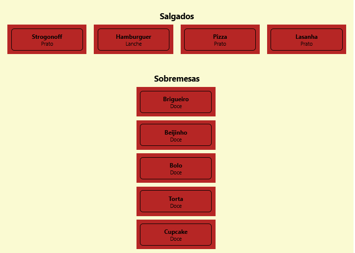

# 📱Barra de Rolagem do React Native

## Objetivo do projeto
### O objetivo deste projeto é criar uma página simples no React Native contendo os componentes para a Barra de Rolagem: SafeAreaView, ScrollView, FlatList e SectionList.

## 🛠️ Tecnologias utilizadas:
### <li> JavaScript;
### <li> React Native.

## 🤳Página feita:

